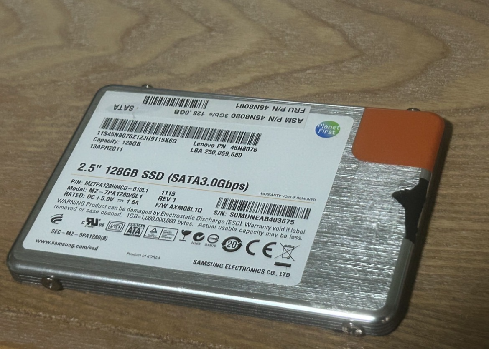
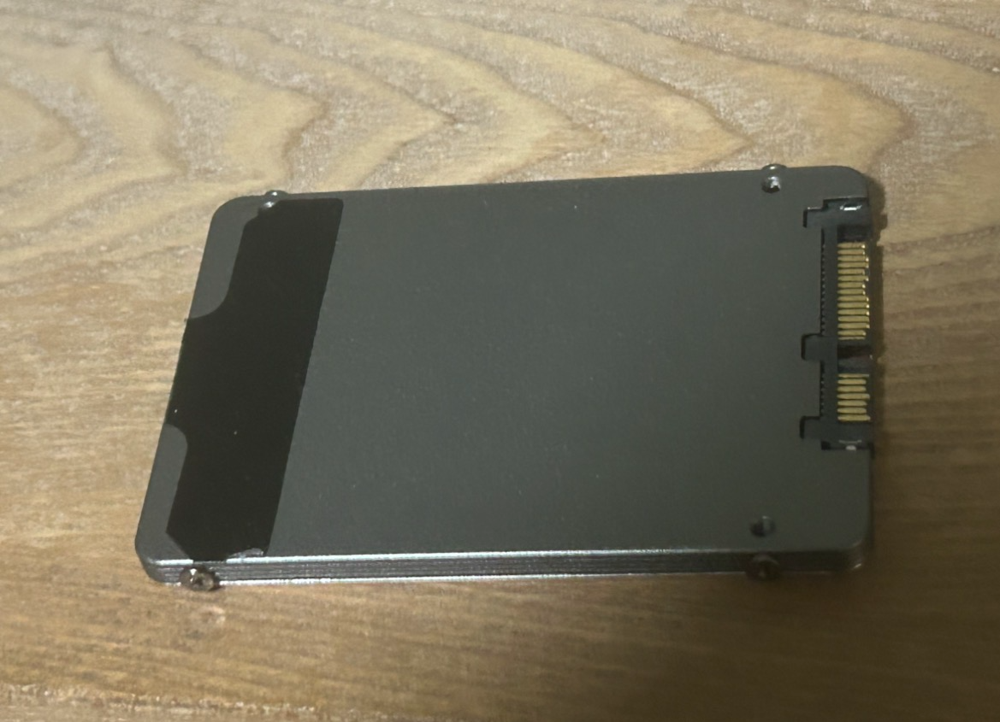
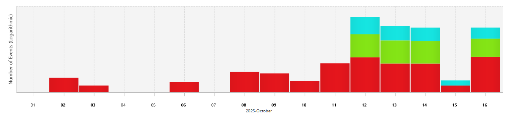
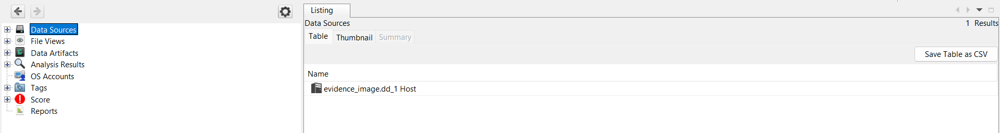

## Disclaimer

- This investigation and all associated findings are intended solely for educational, training, and home-lab purposes.  
- No real-world evidence, sensitive data, or unauthorized systems were accessed or compromised during this exercise.  
- The procedures, tools, and results described in this report are for learning and demonstration only and should not be interpreted as legal or professional forensic advice.

  

## Investigation Report  

**Case Against:** John Doe (fake person)  
**Case No:** 001  

**Report compiled by:** ezloomdev, [Digital Forensic Investigator / Cybersecurity Analyst]  
**Website:** [ezloomdev.cc](https://ezloomdev.cc)  
**Location:** America/NYC  

**Date of Investigation:** 24 October 2025  
**Date Report Compiled:** 26 October 2025  

---

## Endorsement
This report represents the results of an investigation conducted and I hereby confirm that:  

- The investigation followed established U.S. best practices for digital evidence handling.  
- All software and hardware used were configured and employed to preserve the forensic integrity of both the process and its outcomes.  
- The opinions expressed in this report are solely those of the investigator and are based entirely on the collected evidence.

**Signed by:** ezloomdev &nbsp;-&nbsp;&nbsp;[𝑒𝓏𝓁𝑜𝑜𝓂𝒹𝑒𝓋]  
**Date:** 26 October 2025  

---

## Executive Summary
This investigation simulates a digital forensic examination of a Windows 11 environment. The purpose is to demonstrate the acquisition, preservation, and analysis of digital evidence in a controlled, educational setting.

> **Note:** All procedures were conducted for learning purposes using test devices only. Best practices for forensic integrity were followed throughout.

**Key Points:**  
- The investigation develops practical understanding of forensic processes, including evidence handling, imaging, and analysis.  
- The examination focused on a 128GB SSD containing a Windows 11 desktop environment, starting on 24 October 2025.  
- The subject, referred to as John Doe, consented to examination under a lawful search warrant.  
- Main findings include identification of secrept passwords or incriminating artifacts and system configuration details.  
- All recovered artifacts were verified to ensure integrity.  
- The investigation demonstrates proper application of forensic tools, chain-of-custody procedures, and analytical methodology.

---

## Contents
1. [Credentials of the Investigator](#credentials-of-the-investigator)  
2. [Purpose of the Investigation](#purpose-of-the-investigation)  
3. [Target Systems and Devices](#target-systems-and-devices)  
4. [Software to be Used in Support of the Investigation](#software-to-be-used-in-support-of-the-investigation)  
5. [Investigation Methodology](#investigation-methodology)  
6. [A Graphical Timeline of the Incident](#a-graphical-timeline-of-the-incident)  
7. [Evidence Acquisition](#evidence-acquisition)  
8. [Analysis of the Evidence](#analysis-of-the-evidence)  
9. [Summary and Findings in Relation to the Case](#summary-and-findings-in-relation-to-the-case)  
10. [References](#references)  
11. [Appendix 1](#appendix-1)  

---

## Credentials of the Investigator
The investigator is a student focsuing on digital forensics and cybersecurity, with extensive experience in evidence acquisition, incident response, and technical analysis:

- **Work Experience:** Several years in digital forensics, incident response, and cybersecurity research across educational, laboratory, and enterprise environments.  
- **Qualifications:** Bachelor of Science in Computer Science (expected May 2026), with specialized training in digital forensics, malware analysis, and cybersecurity.  
- **Training:** Formal training in forensic imaging, memory analysis, SIEM monitoring, and evidence preservation techniques.  
- **Memberships:** Active participant in professional cybersecurity and digital forensics communities, including academic and industry conferences.  
- **Technical Skills:**  
  - **Forensic Tools:** Autopsy, FTK Imager, X-Ways Forensics, Volatility  
  - **Evidence Handling:** Disk and memory acquisition, write-blocked imaging, chain-of-custody management  
  - **Networking & Security:** Linux, VPNs, TCP/IP, VLANs, firewall configuration, log analysis, incident response  
  - **Programming & Scripting:** Python, Bash, PowerShell  
- **Publications & Research:** Contributions to lightweight malware detection for embedded systems and small language model security research.  
- **Professional Profiles:** [GitHub](https://github.com/gmrrz)  

---

## Purpose of the Investigation
**Case Background:**  
- Simulate a professional digital forensic examination of a Windows 11 desktop environment.  
- Scope includes acquisition, preservation, and analysis of digital evidence to identify artifacts, system configurations, and potential security-relevant data.  
- Serve as an educational exercise to refine forensic methodologies and documentation practices.  

---

## Target Systems and Devices

**Item #1**  
> Lenovo PN 45N8076 – 2.5” 128GB SSD (SATA3.0, fair condition)

    
  

    
  

---

## Software to be Used in Support of the Investigation  

All software and tools used are fully licensed under **ezloomdev.cc** or authorized agents, validated to ensure evidence integrity and reproducibility.  

**Tools Utilized:**  
- **Raspberry Pi 4B (4GB) Forensic Duplicator [1]** – Performs secure disk imaging and verification using `dd` and `sha256sum` to maintain evidence integrity.  
- **Autopsy v4.22.1 [2]** – In-depth forensic analysis, including file system investigation, metadata extraction, deleted file recovery, and timeline reconstruction.  
- **Visual Studio Code v1.105.1 (User Setup) [3]** – Structured documentation, report compilation, and evidence annotation.

---

## Investigation Methodology

### Identification
- Define scope and objectives.  
- Identify systems, devices, and networks involved.  
- Determine types of relevant digital evidence.  

### Imaging
- Create forensically sound image.  
- Document chain-of-custody procedures meticulously.  

### Preservation
- Maintain evidence integrity throughout the process.  

### Collection
- Acquire disk images and system artifacts.  

### Examination and Analysis
- Analyze evidence using Autopsy.  

### Documentation
- Record procedures, observations, and results accurately.  

### Reporting
- Compile findings in a structured and professional report.  

### Presentation of Findings
- Present evidence and analysis clearly.  

---

## A Graphical Timeline

### Usage:

 

---

## Evidence Acquisition
- Used forensic duplicator for disk images and hash value to prove and preserve integrity:

     
     

---

## Analysis of the Evidence
- Conducted detailed file system review using Autopsy.  
- Identified artifacts and key system configuration files.  
- [Full Report](https://ezloomdev.cc/projects/win11_investigation/win11_df_report/report.html)  

 

---

## Summary and Findings in Relation to the Case
- The investigation successfully demonstrated forensic acquisition and analysis of Windows 11 evidence. 
- Critical artifacts, including finding incriminating files and relevant system data, were recovered and verified.  
- The case highlights proper forensic procedures, including imaging, chain-of-custody maintenance, and tool utilization.  
- Recommendations: ongoing training in forensic tools, memory analysis, and structured reporting practices.  

---

## References  
1. Raspberry Pi Foundation. “Raspberry Pi 4 Model B.” Accessed: Oct. 24, 2025. [Online]. Available: https://github.com/gmrrz/Rasp-Pi-Forensic-Duplicator/  
2. Basis Technology. “Autopsy v4.22.1 Digital Forensics Platform.” Accessed: Oct. 26, 2025. [Online]. Available: https://www.sleuthkit.org/autopsy/  
3. Microsoft. “Visual Studio Code v1.105.1 (User Setup).” Accessed: Oct. 24, 2025. [Online]. Available: https://code.visualstudio.com/  

---

## Reflection and Professional Takeaways

This educational lab emphasized the importance of **forensic soundness, clarity, and verifiability**. Key lessons include:  

- Rely on **tool logs** as the objective record, avoiding unnecessary narrative.  
- Use **verified imaging tools** (`dcfldd`, `FTK Imager`) with **stream hashing** for integrity.  
- Keep documentation **minimal, factual, and consistent**—every extra detail is potential risk.  
- Treat reports as **court-facing records**, prioritizing accuracy over exhaustive description.  

This reflection guides my approach from simply learning tools to practicing **professional, defensible forensic workflows**.

